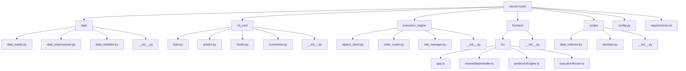

# Neural Order Book Execution Router – Code Documentation

## Project Structure



---

## Core Modules Documentation

### 1. Data Pipeline

#### `data/data_loader.py`
**Purpose:** Interface with Polygon.io API to fetch and stream market data

**Key Functions:**
- `connect_to_polygon()`: Establishes WebSocket connection to Polygon.io
- `fetch_historical_data()`: Retrieves historical L2 order book data
- `stream_realtime_data()`: Real-time data streaming handler
- `store_raw_data()`: Saves raw data to PostgreSQL storage

**Dependencies:** Polygon RESTClient, PostgreSQL, threading

**Usage:**
```bash
python -m data.data_loader --symbol SPY --mode realtime
```

#### `data/data_preprocessor.py`
**Purpose:** Transform raw order book data into model-ready format

**Key Functions:**
- `normalize_order_book()`: Converts raw order book to standardized format
- `compute_order_imbalance()`: Calculates bid-ask imbalance feature
- `calculate_spread_volatility()`: Measures spread volatility metric
- `create_sequence_samples()`: Generates time-series samples for training

**Dependencies:** NumPy, Pandas

**Output:** Normalized tensors for model input

#### `data/data_validator.py`
**Purpose:** Ensure data quality and integrity

**Key Functions:**
- `validate_snapshot()`: Checks for missing/invalid price levels
- `detect_outliers()`: Identifies statistical anomalies
- `check_timestamps()`: Verifies chronological ordering
- `generate_quality_report()`: Creates data quality summary

---

### 2. Machine Learning Core

#### `ml_core/model.py`
**Purpose:** Define GNN-Transformer architecture

**Key Components:**
- `OrderBookGraphConv`: Custom GCN layer for order book processing
- `TemporalTransformer`: Time-series attention mechanism
- `PredictionHead`: Output layer with physics constraints
- `NeuralOrderBookModel`: Complete model assembly

**Architecture:**
<!-- Add architecture diagram/code if available -->

#### `ml_core/train.py`
**Purpose:** Model training pipeline

**Key Features:**
- GPU-accelerated training
- Online learning capability
- Physics-informed loss functions
- Model checkpointing

**Usage:**
```bash
python -m ml_core.train --epochs 100 --batch_size 1024 --use_gpu
```

#### `ml_core/predict.py`
**Purpose:** Real-time prediction service

**Key Functions:**
- `load_model()`: Loads trained model weights
- `preprocess_input()`: Prepares incoming data
- `generate_prediction()`: Runs model inference
- `serve_predictions()`: FastAPI endpoint for serving

**Endpoint:** `POST /predict` with order book snapshot

#### `ml_core/constraints.py`
**Purpose:** Apply market microstructure theory

**Key Constraints:**
- Bid-ask spread conservation
- Inventory effect modeling
- Price impact regularization
- Adverse selection penalty

---

### 3. Execution Engine

#### `execution_engine/alpaca_client.py`
**Purpose:** Interface with Alpaca trading API

**Key Functions:**
- `authenticate()`: API credential validation
- `submit_order()`: Order execution handler
- `get_position()`: Current position check
- `get_account_info()`: Account balance retrieval

**Modes:** Paper trading (default) and live trading

#### `execution_engine/order_router.py`
**Purpose:** Execute trades based on signals

**Decision Logic Example:**
```python
def route_order(signal):
    if signal['spread_widening_prob'] > 0.7:
        execute_market_order('BUY', risk_adjusted_size)
    elif signal['spread_narrowing_prob'] > 0.7:
        execute_market_order('SELL', risk_adjusted_size)
```

**Features:**
- Market/limit order selection
- Intelligent order routing
- Slippage control
- Transaction cost analysis

#### `execution_engine/risk_manager.py`
**Purpose:** Protect against excessive risk

**Key Controls:**
- Position sizing (1% per trade rule)
- Daily loss limits
- Exposure concentration checks
- Circuit breaker triggers

---

### 4. Frontend

#### `frontend/src/app.ts`
**Purpose:** Main application entry point

**Key Responsibilities:**
- Initialize components
- Manage WebSocket connections
- Coordinate data flow
- Handle user interactions

#### `frontend/src/marketDataHandler.ts`
**Purpose:** Process and visualize market data

**Key Features:**
- Real-time order book rendering
- Price level heatmaps
- Depth chart visualization
- Historical context display

#### `frontend/src/predictionEngine.ts`
**Purpose:** Display model predictions

**Components:**
- Spread change probability gauge
- Adverse selection warning indicator
- Prediction confidence meter
- Historical accuracy chart

#### `frontend/src/executionRouter.ts`
**Purpose:** Trade execution interface

**Functionality:**
- Manual override controls
- Paper/live trading toggle
- Execution log display
- P&L performance tracking

---

### 5. Scripts

#### `scripts/data_collector.py`
**Purpose:** Bulk data collection utility

**Usage:**
```bash
python scripts/data_collector.py --symbol SPY --start 2024-01-01 --end 2024-03-01
```

**Features:**
- Parallel data fetching
- Automatic retries
- Compression and archiving
- Metadata tracking

#### `scripts/backtest.py`
**Purpose:** Strategy validation framework

**Key Metrics:**
- Prediction accuracy
- Implementation shortfall
- Sharpe ratio
- Maximum drawdown

**Usage:**
```bash
python scripts/backtest.py --model_version v1.2 --capital 100000
```

---

### 6. Configuration

#### `config.py`
**Purpose:** Centralized configuration management

**Key Settings:**
```python
# API Credentials
POLYGON_API_KEY = os.getenv("POLYGON_API_KEY")
ALPACA_API_KEY = os.getenv("ALPACA_API_KEY")

# Model Parameters
ORDER_BOOK_LEVELS = 10
PREDICTION_HORIZON = 500  # microseconds

# Execution Parameters
RISK_LIMIT_PER_TRADE = 0.01  # 1% of capital
MAX_DAILY_LOSS = 0.05  # 5% of capital

# Path Configuration
DATA_DIR = "data/"
MODEL_DIR = "ml_core/models/"
```

#### `requirements.txt`
**Purpose:** Python dependencies specification

**Key Packages:**
```text
torch==2.1.0
torch-geometric==2.4.0
alpaca-trade-api==2.3.0
polygon-api-client==1.13.3
psycopg2-binary==2.9.9
fastapi==0.104.1
```

---

## Development Workflow

### Setup Environment
```bash
python -m venv .venv
source .venv/bin/activate
pip install -r requirements.txt
```

### Data Collection
```bash
python scripts/data_collector.py --symbol SPY --frequency 100ms
```

### Model Training
```bash
python -m ml_core.train --epochs 50 --batch_size 2048 --use_gpu
```

### Start System
```bash
# Start prediction service
python -m ml_core.predict

# Start execution engine
python -m execution_engine.main

# Launch frontend
cd frontend
npm run dev
```

### Backtesting
```bash
python scripts/backtest.py --start_date 2024-01-01 --end_date 2024-03-01
```

---

## Key Architectural Decisions

- **Vertical Data Flow:**
  - Raw data → Processing → Prediction → Execution
  - Each stage produces validated inputs for next stage
- **Decoupled Components:**
  - Clear interfaces between modules
  - Replaceable components (e.g., different brokers)
  - Independent scaling
- **Physics-Informed AI:**
  - Hard constraints prevent unrealistic predictions
  - Incorporates market microstructure theory
  - Regularizes model behavior
- **Progressive Enhancement:**
  - SPY-only initial implementation
  - Paper trading before live execution
  - Basic features before optimization

---

## Maintenance Notes

- **Data Validation:**
  - Run `data_validator.py` weekly
  - Monitor data quality metrics
- **Model Retraining:**
  - Schedule weekly retraining
  - Monitor prediction drift
- **Performance Monitoring:**
  - Track key execution metrics:
    - Implementation shortfall
    - Adverse selection rate
    - Prediction accuracy
  - Set up alerts for metric degradation
- **Security:**
  - Rotate API keys quarterly
  - Restrict database access
  - Audit trail for all executions