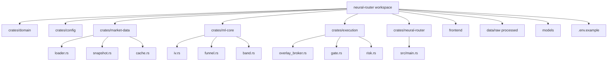

# Neural Order Book Execution Router – Code Documentation

## Project Structure

Cargo workspace. Libraries expose a small public API from `lib.rs`; binaries stay thin.



Dependency rule: `domain` and `config` have no crate-graph children. I/O lives behind traits (`ChainSource`, `Broker`).

---

## Core Crates

### `crates/domain` (`neural-router-domain`)

Shared overlay types: `OptionContract`, `Greeks`, `Policy`, `TicketProposal`, `NewOrder`, `Reject`.

No I/O, no config, no broker types.

### `crates/config` (`neural-router-config`)

`Settings::from_env()` and `Settings::default()`.

API keys are optional at load time so tests do not need credentials. `Debug` redacts secrets. Brokers must fail closed if keys are missing.

### `crates/market-data` (`neural-router-data`)

| Module | Role |
|--------|------|
| `loader` | `ChainSource`; fixture + placeholder vendor |
| `snapshot` | `validate_chain`, `SnapshotRing` |
| `cache` | L1 TTL + 429 negative cache |

### `crates/ml-core` (`neural-router-ml`)

| Module | Role |
|--------|------|
| `iv` | European BS + Newton IV |
| `funnel` | layers 1–5 + 7; skip SVI |
| `band` | `dollar_delta`, `band_status` |

### `crates/execution` (`neural-router-execution`)

| Module | Role |
|--------|------|
| `overlay_broker` | `Broker`; Alpaca paper REST + mock HTTP tests |
| `gate` | 1%/5%/over-hedge/IOC; `client_order_id` |
| `risk` | overlay cents book |

### `crates/neural-router` (binary)

Clap: `serve`. Loads `.env`, then `Settings::from_env()`. Loopback overlay API.

### Frontend

TypeScript dashboard. Not part of the Cargo graph.

---

## Configuration

See `.env.example`. Defaults:

- `RISK_LIMIT_PER_TRADE=0.01`
- `MAX_DAILY_LOSS=0.05`
- `ALPACA_PAPER=true`
- `SYMBOL=SPY`

---

## Development Workflow

```bash
cargo test --workspace
cargo clippy --workspace --all-targets
cargo run -- --help
```

I/O commands currently exit with `not implemented: …` until Polygon, training, Alpaca transport, and replay are written.

---

## Architectural Decisions

- **Workspace, not a mega-crate.** Each crate has one reason to change.
- **Vertical data flow:** raw snapshot → validate → features → predict → risk → route.
- **Traits at I/O edges.** Polygon and Alpaca are replaceable.
- **Fail closed.** Missing broker credentials and broken books are errors, not defaults to trade.
- **Physics constraints** live in `ml-core`, independent of the model backend.
- **Progressive enhancement:** SPY-only, paper trading, then live.

---

## Maintenance Notes

- Run `cargo test --workspace` on every change to domain/risk/router.
- Rotate API keys quarterly; they must never appear in source, logs, or `Debug`.
- Retrain on a schedule once the training adapter exists.
- Track implementation shortfall, adverse selection rate, and prediction accuracy once execution is live.
